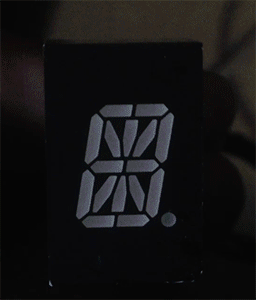

# Starburst One: Alphanumeric Display Driver

This is a little weekend project I made with parts I had lying around: an [Atmel ATtiny461A](http://www.atmel.com/devices/ATTINY461A.aspx) drives an [LTP-587G](http://www.mouser.com/ProductDetail/Lite-On/LTP-587G/?qs=gnaPJ2cis73gi9y0T4zVCA%3D%3D) alphanumeric LED display. The only additional part needed is a 68 ohm current limiting resistor. Power is +5V from a USB wall adapter.

AVR-GCC source and KiCad design files are included. This is my first KiCad project: I've used [gEDA](http://geda-project.org) for everything in the past, but development seems to be stagnating and it's a pain to use on a Mac.

The PCB is the same size as the display itself. It is single-sided and requires one jumper wire to be placed. (indicated by the single trace on the back copper layer in the PCB layout.) I made one with an [Othermill](https://othermachine.co), using 1/32" and 1/64" flat endmills. Hand soldering is straightforward, but the ATtiny's large SOP-20 package is just a bit too big for my footprint, so I had to squeeze the legs in a little bit beforehand.

The firmware displays a hard-coded message one character at a time, with short blanking periods between each so that consecutive identical characters can be distinguished. All segments are multiplexed: only one is ever lit at a time. However, because the ATtiny461A only has 15 usable I/Os (PB7 must be used for /RESET in order to use in-system programming) I tied the top two segments together. There is no apparent effect on brightness.

The code is pretty much the simplest thing that could work. No interrupts, no fancy animations, no user input. I will most likely leave this project in its current state and build a second version using an MCU capable of driving all segments, as well a brighter/larger LED module.

## Compilation/Flashing

Run `make hex` to build the firmware image. Run `make program` to burn the fuses and flash the microcontroller using your AVR programmer of choice. You may need to edit the Makefile if you're using a programmer other than the AVRISP mkII.

There is no programming header on the board. You'll have to flash the chip before soldering it, or attach thin wires to `MISO`, `MOSI`, `SCK`, `/RESET`, `VCC`, and `GND`. (You can hook up `MISO`, `MOSI`, and `SCK` with a wire-wrap tool on the respective pins of the LED module.)

For reasons I have not investigated, I couldn't get initial flashing to work when powered from 5V. Lowering the supply voltage to 3V fixed this.
